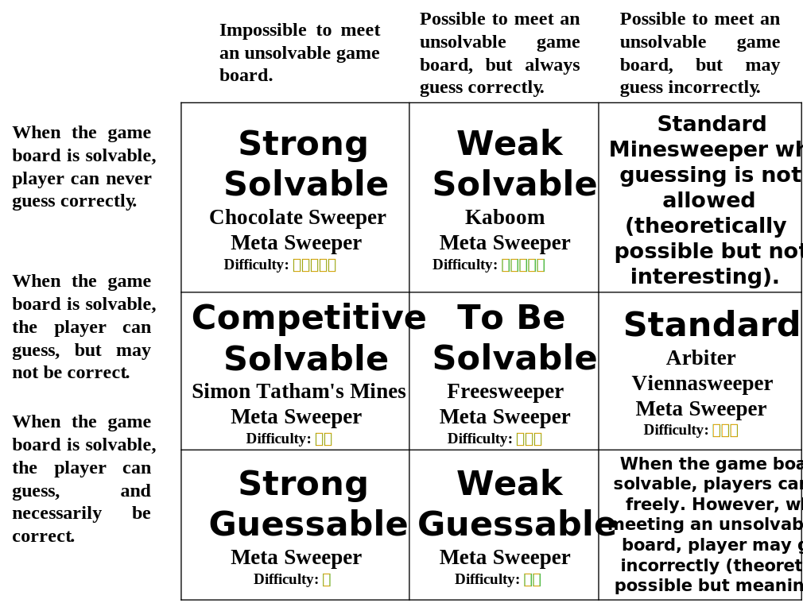

## evf: The Second Open-Source Minesweeper Video Format in History

* The full specification and historical versions are open-sourced at: https://github.com/eee555/ms_toollib/blob/main/evf%E6%A0%87%E5%87%86.md
* In case of any conflict between different language versions, the Chinese version shall prevail.

Both AVF and RMV formats for Minesweeper replays have become technically stable, allowing specialized clones like Arbiter and Viennasweeper to easily record and play their own generated replays. However, this software-centric model is closed, preventing new software from generating these formats. According to [thefinerminer](https://minesweepergame.com/forum/viewtopic.php?f=26&t=1330), currently, due to developers leaving, parsing these files relies on reverse engineering, making it unsafe and restrictive for developers to convert between different formats. To overcome this issue, on one hand, Freesweeper is able to replay multiple video formats on a single software for the first time. On the other hand, Freesweeper can convert other video formats to the [rawvf](https://github.com/thefinerminer/minesweeper-rawvf) format (the first open-source Minesweeper video format). The ability to replay multiple formats and convert them into a unified format is undoubtedly the direction for future development. However, rawvf mainly addresses human readability issues, similar to a parser's debug information, which not only makes it hard to satisfy everyone's preferences but also unnecessarily occupies disk space, contrary to general engineering practices.

Furthermore, existing formats have the following shortcomings: (1) Insufficient precision. With hardware advancements, timing precision can now reach millisecond levels. (2) Lack of support for UTF-8 encoding, which supports global languages. (3) Inability to record the screen before the game starts, such as marking mines before the game begins, moving after the first left-click, and holding time. (4) Only user identifiers are available without dedicated race identifiers, making parsing difficult. (5) Lack of uniqueness identifiers, making it impossible to distinguish between users with the same name. (6) No flag indicating whether the game is completed, requiring the entire game to be parsed to determine completion. (7) Fixed cell size of 16 pixels in the board.

To address these issues, this specification proposes the evf (eee555's Minesweeper Video Format).

With the following features:
- Easy encoding and decoding for computers. Unlike the RAWVF format, developers deny that computer readability and human readability can be balanced.
- evf is a completely independent video format, not bound to any software or video parser.
- Adheres to Kerckhoffs's principle, using a checksum instead of obfuscation.
- Compared to the currently most popular `avf` format, `evf` is high-precision, with precision retained to the millisecond.
- Integer data is stored in big-endian format.
- Strings of directly generated videos are encoded in utf-8, which can encode any language, character, and symbol. For transcoded videos, possible encoding methods are provided.
- Adjustable cell size, matching the actual screen size.
- Recording starts from the earliest left or right click that affects the game before it begins.
- Comes with a readable, unambiguous white paper (this document) and reliable project support, with no hidden details or backdoors.

While it has the following limitations:
- Applicable to only one video.
- Not suitable for replays where game settings or modes switch mid-game, such as switching question marks, changing from standard to recursive, modifying cell sizes, etc.
- Not suitable for replays lacking operation details. For example, in this format, "l" indicates the pressing or releasing of the left button, not both; the latter is an instantaneous press or release, which cannot be recorded in this format.
- Only applicable to Minesweeper game replays with 2D square layouts and classic mines, not suitable for quantum Minesweeper, Minesweeper with positive and negative mines, multiple mines in one cell, polygonal cell Minesweeper, 3D Minesweeper, etc.
- Only applicable to single-player Minesweeper game replays, not suitable for multiplayer variations.
- Pixel size of cells ranges from 5-255, row range from 1-255, and column range from 1-255. Row * pixel_size <= 32767, column * pixel_size <= 32767. Suitable for replays up to 136 years long.

### Design goals/decisions

The evf format is not a revolutionary innovation but a necessary, appropriate supplement based on traditional rules. Besides the obvious benefits of increased security, more mode types, transparency, and improved precision, the profound significance of using evf includes:
1. Enhancing users' ownership of their data. Traditional video file formats only contain identifiers, AVF further includes country, but whether it contains other information ensuring users' ownership of data is unknown. However, evf's user identifiers and unique identifiers can help users ensure the uniqueness of their identifiers. evf further records the user's device UUID, maximizing the difficulty of identity forgery.
2. Decentralization. evf format video files are independent of websites, software, and players. Unlike centralized platforms like WOM, even if the website closes, the legality of evf files remains unaffected. Users can upload to other websites once new ones are established.

### Comparison to Alternatives
- Compared with AVF: AVF is widely used, but not open-source, and its design is old-fashioned and backward. There is no reason to use AVF in new replicas.
- Compared with [RMV](https://github.com/ralokt/rmv_spec): RMV enforces the presence of board events and doesn't have a UUID, but its file size is slightly larger than EVF. RMV is still being maintained and has certain features. If it indeed meets your requirements, you can consider using it.
- Compared with [RAWVF](https://github.com/thefinerminer/minesweeper-rawvf): EVF is machine - readable, while RAWVF is human readable. No player has to convert to RAWVF for playback, so there is no reason to use RAWVF videos.

### Toolchain
The design of the evf format is backed by a solid project background and a complete toolchain for support. [Metasweeper](https://github.com/eee555/Metasweeper) is one of the clones for obtaining evf replays; [ms-toollib](https://github.com/eee555/ms_toollib) helps developers read and parse evf replays and convert other formats to evf; [Flop New Player](https://github.com/eee555/flop-player) assists ranking websites in playing evf replays; additionally, [Open Minesweeper](https://openms.top) accepts user-uploaded evf replays for global rankings.

Acknowledgments: 13688 (testing), ralokt (suggestions), 9952 (suggestions), 36 (suggestions)

### Operation Type Symbols Defined in This Specification:
- "mv": mouse move
- "lc": left-click press
- "lr": left-click release
- "rc": right-click press
- "rr": right-click release
- "mc" (not recommended): middle-click press (equivalent to double-click press)
- "mr" (not recommended): middle-click release (equivalent to double-click release)
- "pf" (not recommended): marking mines before the game starts. Some clones do not record the process before the game starts (i.e., before the first valid left-click release), but directly record which mines are marked. This operation cannot be equated to "rc" + "rr" because it involves how to count rights. For example, before the game starts, if you mark one mine, then repeatedly flag and unflag another mine before starting the game with a left-click, how to count the right-clicks in the whole game? In ms_toollib, the pf mark records right+1, flag+1, but it is not necessarily accurate.
- "cc" (not recommended): the file records a double-click press, but it's unclear which button is pressed, requiring the mouse finite-state machine in the parser to determine which button is up at the time.
- "l" (not recommended): left-click press or release, requiring the mouse finite-state machine in the parser to determine whether it's a press or release.
- "r" (not recommended): right-click press or release, requiring the mouse finite-state machine in the parser to determine whether it's a press or release.
- "m" (not recommended): middle-click press or release, requiring the mouse finite-state machine in the parser to determine whether it's a press or release.

### Terminology Defined in This Specification
- "Solvable," "Unsolvable": In this specification, "unsolvable" refers to the existence of any unsolvable small matrix under the theoretical framework of ["partitioning," "segmentation"](https://github.com/eee555/ms_toollib/blob/main/base/src/lib.rs#L10-L11), also known as local unsolvability. The opposite is the "solvable" state.
- "Solvable": The "Solvable" board must meet the following conditions: (1) After the first click, the game board remains solvable. (2) Assuming the game board is solvable after the nth click, the game board should remain solvable or already win when clicking any non-mine position afterward. (3) When solving the game board, there is no need to introduce the total number of mines as a constraint.
- "Standard Solvable": In addition to the "solvable" conditions, the "standard solvable" game board must meet the condition that: (1) The location of the first click is selected by the player, and ensure that it is not mine. (2) Any board must be generated by the filtering method, i.e., the algorithm should uniformly plant mines without checking, then filter out boards that meet the constraints.
- "Strong Solvable": The algorithm guarantees that the game board is always solvable during mine planting. During the game, if the player clicks a position that could be a mine, even if it is not, the game is immediately lost. Examples of this rule include mobile games like Chocolate Sweeper.
- "Weak Solvable": Although the algorithm does not ensure the game board is always solvable, it can always determine if the game board is unsolvable. During the game, if the player encounters an unsolvable game board, the next click, regardless of where it is, will not result in a loss. However, if the player encounters a solvable game board but does not click a certain non-mine position, the game will result in a loss. Examples of this rule include [Kaboom](https://pwmarcz.pl/kaboom/).
- "Competitive Solvable": The algorithm ensures the game board is always solvable. During the game, even if the player clicks a position that could be a mine, as long as it is not, the game continues. Example of this rule includes [Simon Tatham's Mines](https://www.chiark.greenend.org.uk/~sgtatham/puzzles/js/mines.html). Since the algorithm is not a filter method, it is not "standard solvable".
- "To Be Solvable": The algorithm does not guarantee that the game board is always solvable. However, it can always determine whether the game board is unsolvable. During the game, even if the player encounters an unsolvable game board, the next click will not result in a loss. Example of this rule includes Freesweeper.
- "Strong Guessable": Although the algorithm guarantees that there is always a solution on the game board, it is still possible to guess where the mines are even when the game board can be determined. Furthermore, even if a guess is wrong, if there is a probability that the cell is not a mine, the game board will automatically adjust to make sure that the cell is indeed not a mine. Additionally, in the following steps, the game board will continually adjust to ensure that no guessing is required.
- "Weak Guessable": The algorithm does not guarantee that there is always a solution on the game board in advance. Players can guess where the mines are at will. Furthermore, even if a guess is wrong, if there is a probability that the square is not a mine, the game board will automatically adjust to make sure that the square is indeed not a mine.

The various modes and their names can be further summarized as shown in the following diagram.

### v0.4 (Used by Metasweeper 3.2.1)

Format Description:

1. Fixed length 1 byte: Version number. In this version, it is '\4'.
2. Fixed length 1 byte: Summary. In high trust scenarios, it serves to reduce the parsing complexity.
    - Fixed length 1 bit (2e7): Whether the replay is completed. `1` indicates completion. The software attests that the game has ended, meaning no mines were struck and no values (like time) have overflowed. No other conditions are guaranteed.
    - Fixed length 1 bit (2e6): Whether the replay is official. `1` indicates it is official. The software verifies that the game is official and definitely completed, including no 3BV filtering by software, no use of auxiliary functions, being in the standard mode, and no value overflow. It doesn't necessarily meet the additional 3BV restrictions of ranking websites. (This flag is useful for minesweeper ranking websites that only support the standard mode.)
    - Fixed length 1 bit (2e5): Whether the replay is fairly completed. `1` indicates fair completion. The software guarantees that the game is fairly finished, definitely completed, for instance, no 3BV filtering by software, no use of auxiliary functions, and no value overflow. The difference between a fairly completed game and an official one is that only the standard game mode can be official, while modes such as upk and no-guess can be fairly completed but not official. If it is official, it must be fairly completed. (This flag is beneficial for minesweeper ranking websites that support multiple modes.)
    - Fixed length 1 bit (2e4): Whether it is no flag (NF) sweeping. A value of 1 means it is NF, equivalent to right_eff == 0; 0 otherwise.
    - Fixed length 1 bit (2e3): Transcoded video flag. `0` means this video is not transcoded; `1` means this video is transcoded, for example, an evf video obtained by transcoding an avf or evf video using Meta Minesweeper.
    - The remaining bits are reserved and all set to 0; they can be added according to the requirements of ranking websites and score statistics application developers.
3. Fixed length 1 byte: Game settings. These settings are designed to offer appropriate convenience (or inconvenience) to players while generally being considered not to affect the formality and fairness of the score.
    - Fixed length 1 bit (2e7): Whether to turn off question marks. A value of 1 means they are turned off.
    - Fixed length 1 bit (2e6): The mouse pointer cannot exceed the border. A value of 1 means it cannot.
    - Fixed length 1 bit (2e5): Whether auto - restart on hitting a mine is enabled. A value of 1 means it is enabled.
    - The remaining bits are reserved and set to 0; they can be added according to the requirements of clone developers.
4. Fixed length 1 byte, uint8: Number of rows, ranging from 1 to 255, and rows × cell size <= 32767.
5. Fixed length 1 byte, uint8: Number of columns, ranging from 1 to 255, and columns × cell size <= 32767.
6. Fixed length 2 bytes, uint16: Number of mines.
7. Fixed length 1 byte, uint8: Cell size, ranging from 5 to 255, and rows × cell size <= 32767, columns × cell size <= 32767.
8. Fixed length 2 bytes, uint16: Game mode (symbols and meanings: 0->standard, 1->upk; 2->cheat; 3->Density (from Viennasweeper), 4->win7, 5->Competitive Solvable, 6->Strong Solvable, 7->Weak Solvable, 8->To Be Solvable, 9->Strong Guessable, 10->Weak Guessable, 11->Chording Recursive (standard recursive), 12->Flag Recursive, 13->Chording Flag Recursive, 14->Solvable Chording Recursive, 15->Solvable Flag Recursive, 16->Solvable Chording Flag Recursive, 65535 -> no rule, the rest are reserved and can be added according to the requirements of new clone developers).
9. Fixed length 2 bytes, uint16: 3BV value.
10. Fixed length 4 bytes, uint32: Real time (rtime), in milliseconds.
11. Fixed length 2 bytes: Name or code of the country or region. Adopt the two letter uppercase encoding of the ISO 3166-1:2020 standard country or region code, enabling the video player to correctly display the flag of country or region.
12. Fixed length 8 bytes, uint64: Start timestamp, which is the total number of microseconds from January 1, 1970, in Greenwich Mean Time to the moment of the first left button release on a non-flagged cell.
13. Fixed length 8 bytes, uint64: End timestamp, which is the total number of microseconds from January 1, 1970, in Greenwich Mean Time to the moment when all non-mine cells are opened.
14. String ending with '\0', encoded in 'utf-8': The original source of the recording, including the software name and version number. Possible values include "Arbiter", "0.97 beta", "Viennasweeper", "Meta 3.1.9", etc. Ranking websites need to check the source of the recording.
15. String ending with '\0', encoded in 'utf-8': only present in transcoded replays: Name of the transcoding software, including the software name and version number. Possible values include "Meta 3.1.9", "Meta 3.1.11", "Meta 3.2", etc. If it is empty, it indicates that this recording is directly generated by the software rather than being transcoded.
16. String ending with '\0', encoded in 'utf-8': only present in transcoded recordings: Possible encoding methods for the user identifier, competition identifier, and unique identifier of the recording. Possible values include 'utf-8', 'utf-16', 'utf-16-be', 'utf-16-le', 'gbk', 'gb2312', 'big5','shift-jis', 'cp932', 'latin-1', 'ascii', 'iso-8859-1', etc. An empty value means it is unknown.
17. String ending with '\0', encoded in 'utf-8': User identifier (the user wishes the ranking website/software to display this identifier in the most prominent position).
18. String ending with '\0', encoded in 'utf-8': Competition identifier (the user intends to use this recording as a voucher to participate in a certain competition but does not want the ranking website/software to display this identifier).
19. String ending with '\0', encoded in 'utf-8': Unique identifier (the user wants to distinguish themselves from other users with the same name, such as nickname, ranking website ID, province, email, online name, motto, but does not want the ranking website or software to display this identifier).
20. Fixed length 2 bytes, uint16: Length of UUID.
21. Variable length binary data: UUID related to device information, preferably 32 bit. Note that developers need to protect user privacy.
22. Variable length ⌈rows × columns / 8⌉ bytes: `1` represents a mine, `0` represents not a mine. The `i × columns + j` - th bit represents whether the `i`-th (starting from 0) row and `j`-th (starting from 0) column is a mine. For example, for the following 3 row, 4 column board (with * representing mines):  
        [[1, 3, *, *],  
         [3, *, *, *],  
         [*, *, *, *]]
    it is recorded as 00110111 11110000.
23. Fixed length 2 bytes, uint16: Number of custom metrics.
24. List of custom - metric key names (loop structure):
    - String ending with '\0', encoded in 'utf-8': Key name.
25. Event list (loop structure):
    - Fixed length 1 byte: Event type. Events are classified into mouse event, termination event, board event, metric event, and pause event. Mouse event encodings: {1: "mv", 2: "lc", 3: "lr", 4: "rc", 5: "rr", 6: "mc", 7: "mr", 8: "pf", 9: "cc", 10: "l", 11: "r", 12: "m"}. Termination event encodings: {81: "replay", 82: "win", 83: "fail", 99: "error"}. Board event encodings: {100: "cell_0", 101: "cell_1", 102: "cell_2", 103: "cell_3", 104: "cell_4", 105: "cell_5", 106: "cell_6", 107: "cell_7", 108: "cell_8", 110: "up", 111: "flag", 114: "cross mine", 115: "blast", 116: "mine", 118: "pressed", 120: "questionmark", 121: "pressed questionmark"}. Metric event encodings: {200: "set key number value", 201: "set key string value"}. Pause event encoding: {255: "pause"}. The rest are reserved (except '\0').
    - Mouse - event structure:
        - Fixed length 1 byte, uint8: Increment of the timestamp, in milliseconds. Starting from 0 when the first left - or right click that affects the board occurs, and then it is the difference between the subsequent timestamp and the previous one. That is, the timestamp of the first left button release on a non-flagged cell is not necessarily 0, and the timestamp of the last operation is greater than or equal to the actual time used.
        - Fixed length 2 bytes, int16: Change in the distance from the left border (in pixels), which is the value of the subsequent operation minus the previous one. The outside board event is recorded as the difference with `columns × cell size`.
        - Fixed length 2 bytes, int16: Change in the distance from the top border (in pixels), which is the value of the subsequent operation minus the previous one. The outside board event is recorded as the difference with `rows × cell size`.
    - Game - state event structure:
        - Fixed length 1 byte, uint8: Increment of the timestamp, in milliseconds.
    - Board - state event structure:
        - Fixed length 1 byte, uint8: Increment of the timestamp, in milliseconds.
        - Fixed length 1 bytes, int16: Change in the distance from the left border (in cells). The operation outside the board from the left border is recorded as "columns".
        - Fixed length 1 bytes, int16: Change in the distance from the top border (in cells). The distance operation outside the board from the top border is recorded as "rows".
    - Metric - event structure:
        - Fixed length 1 byte, uint8: Increment of the timestamp, in milliseconds.
        - Fixed length 2 bytes, uint16: Index of the metric (starting from 0) + 10000.
        - Numeric metric:
            - Fixed length 8 bytes, float64: Value of the metric.
        - String metric:
            - String ending with '\0', encoded in 'utf-8': Value of the metric.
    - Pause - event structure:
        - Fixed length 2 bytes, uint16: Increment of the timestamp, in milliseconds.
26. '\0': End of event list.
27. Fixed length 2 bytes, uint16: Checksum length.
28. Variable length binary data: Checksum.

### v0.3 (Used by Metasweeper 3.1.9, Metasweeper 3.1.11, Metasweeper 3.2.0)

Format Description:

1. Fixed length 1 byte: version number. The version described in this specification is '\3'.
2. Fixed length 1 byte: summary. In high-trust scenarios, it reduces parsing complexity.

    > Fixed length 1 bit (2e7): Whether the game is completed, 1 means completed. The software proves that the game is completed, i.e., no mines were hit, and no values overflowed. No other conditions are guaranteed.

    > Fixed length 1 bit (2e6): Whether it is official, 1 means official. The software proves that the game is official, definitely completed, including no 3BV filter used, no auxiliary functions used, standard mode, and no values overflowed. Not necessarily meeting extra 3BV constraints for ranking sites. (This flag is convenient for ranking sites supporting only standard mode minesweeper)

    > Fixed length 1 bit (2e5): Whether it is fair, 1 means fair. The software proves that the game is fairly completed, definitely completed, for example, no 3BV filter used, no auxiliary functions used, and no values overflowed. Fair and official are different: only standard game mode can be official, while modes like upk, solvable, etc., are not official but can be fairly completed. If official, it must be fair. (This flag is convenient for ranking sites supporting multiple modes)

    > Fixed length 1 bit (2e4): Whether it is no flag (NF), 1 is NF, equivalent to right == 0; 0 for others.
    
    > Remaining bits reserved and set to 0; added based on ranking sites, score statistics application developers' requirements.
3. Fixed length 1 byte: game settings. These settings aim to provide convenience (or inconvenience) to players while being widely recognized as not affecting the formality or fairness of the score.

    > Fixed length 1 bit (2e7): Whether to disable question marks, 1 means disabled.

    > Fixed length 1 bit (2e6): The mouse pointer cannot move out of the board, 1 means cannot move out.

    > Fixed length 1 bit (2e5): Whether automatic restart on loss is enabled, 1 means enabled.

    > Remaining bits reserved and set to 0; added based on clones developers' requirements.

4. Fixed length 1 byte: number of rows.
5. Fixed length 1 byte: number of columns.
6. Fixed length 2 bytes: number of mines, big-endian.
7. Fixed length 1 byte: cell size.
8. Fixed length 2 bytes: game mode (symbols and meanings: 0->standard, 1->upk; 2->cheat; 3->Density (from Viennasweeper software), 4->win7, 5->Competitive Solvable, 6->Strong Solvable, 7->Weak Solvable, 8->To Be Solvable, 9->Strong Guessable, 10->Weak Guessable, 11->Chording Recursive (standard recursive), 12->Flag Recursive, 13->Chording Flag Recursive, remaining reserved, added based on new clones developers' requirements), big-endian.
9.  Fixed length 2 bytes: 3BV value, big-endian.
10. Fixed length 3 bytes: time (rtime), in milliseconds, big-endian.
11. A string ending with '\0': source of the recording. For example, if it comes from Meta Minesweeper 3.1, it is "Meta 3.1". Ranking sites need to check the source of the recording.
12. A string ending with '\0': user identifier (the user wants the ranking site or software to prominently display this identifier)
13. A string ending with '\0': championship identifier (the user wants to use this identifier as a credential to participate in a championship but does not want the ranking site or software to display this identifier)
14. A string ending with '\0': unique identifier (the user wants to distinguish from other users with the same name, such as nickname, saolei.wang ID, province, email, online name, motto, but does not want the ranking site or software to display this identifier)
15. A string ending with '\0': start timestamp, recommended to use the total microseconds since January 1, 1970, in Greenwich Mean Time. The time of the first left-click released on a non-flagged cell.
16. A string ending with '\0': end timestamp, recommended to use the total microseconds since January 1, 1970, in Greenwich Mean Time.
17. A string ending with '\0': country or region name or code. It is recommended to use the two-letter uppercase code of the ISO 3166-1:2020 standard country or region code so that the player can correctly display the national flag.
18. A string ending with '\0': device information-related UUID, preferably 32 bits. Note that developers need to protect users' privacy.
19. Variable length ⌈number of rows × number of columns / 8⌉ bytes: 1 represents a mine, 0 represents a not mine. The ***i × number of columns + j***th bit represents whether the *i*th (starting from 0) row, *j*th (starting from 0) column is a mine. For example, the following 3 rows, 4 columns board (with * representing mines):  
        [[1, 3, &ast;, &ast;],
         [3, &ast;, &ast;, &ast;],
         [&ast;, &ast;, &ast;, &ast;]]
    is recorded as `00110111 11110000`.
20. Mouse event format (loop structure):

    > Fixed length 1 byte: operation type. 1: "mv"; 2: "lc"; 3: "lr"; 4: "rc"; 5: "rr"; 6: "mc"; 7: "mr"; 8: "pf"; 9: "cc"; 10: "l"; 11: "r"; 12: "m"; remaining reserved (except '\0', '\255').

    > Fixed length 3 bytes: timestamp, in milliseconds. Recorded from the first left or right click that affects the game board as 0, then incremented. The timestamp of the first left-click release on a non-flagged cell may not be 0, and the timestamp of the last operation is greater than or equal to the actual time used. Big-endian.

    > Fixed length 2 bytes: distance from the left border, in pixels. The distance of operations outside the board is recorded as "number of columns × cell size". Big-endian.

    > Fixed length 2 bytes: distance from the top border, in pixels. The distance of operations outside the board is recorded as "number of rows × cell size". Big-endian.

21. Fixed length 1 byte: '\0' indicates a checksum (recording directly generated by software); '\255' indicates no checksum (e.g., translated from avf files).

22. Fixed length 32 bytes: checksum, optional.