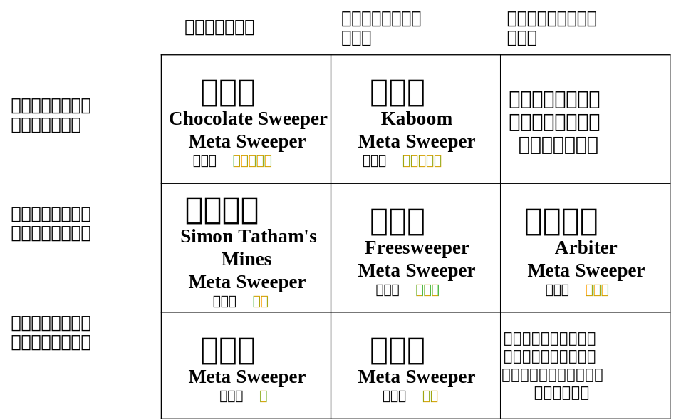

## evf：史上第二款开源的扫雷录像格式

* 本规范全文和历史版本均开源在：https://github.com/eee555/ms_toollib/blob/main/evf%E6%A0%87%E5%87%86.md*
* 假如各语言版本内容发生冲突，以中文版为准。

无论avf还是rmv，扫雷录像的文件格式在技术上逐渐定型，Arbiter、Viennasweeper等专业复刻版本可以轻松地记录并播放它们自己产生的录像。但这种以软件为中心的模式是封闭的，新的软件永远不能产生这些格式的文件。按照[thefinerminer](https://minesweepergame.com/forum/viewtopic.php?f=26&t=1330)的说法，目前，由于开发人员退圈，对这些文件的解析均依赖逆向，开发人员无法安全、自由地在各种格式之间转换。为了克服这个问题，一方面，freesweeper首次实现了在一款软件上播放多种格式的录像。另一方面，freesweeper也能将其他格式的录像文件转换成[rawvf](https://github.com/thefinerminer/minesweeper-rawvf)格式（这是首款开源的扫雷录像格式）。同时能够播放多种格式和将多种格式转换成统一的格式无疑是未来发展的方向。然而，rawvf解决的主要问题是人类易读性问题，这就类似于解析器的debug信息，不仅众口难调，而且无谓地占用磁盘空间，也不符合工程实践的一般原则。

不仅如此，现有的文件格式还有以下缺点。（1）精度不够。随着硬件的发展，计时精度已经能达到毫秒级。（2）不支持utf-8等支持全球各种语言的编码。（3）不能记录游戏开始前的画面，例如，游戏开始前的标雷过程、第几次左键按下后的移动、保持时间。（4）只有用户标识没有专用的比赛标识，导致解析困难。（5）只有用户标识没有唯一性标识，一旦同名就无法区分。（6）没有是否扫完的标志，必须解析完全局才能知道是否扫完。（7）局面中格子的尺寸是固定的16像素。

为了解决这些问题，本规范提出一种具有如下特点的evf（eee555's minesweeper video format）格式。

具有如下特性：
- 对于计算机，编码、解码方便。不同于RAWVF格式，开发人员否认计算机易读和人类易读可以兼顾。
- evf格式是一种完全独立的，不与任何软件、录像解析器进行绑定的录像格式。
- 遵循柯克霍夫原则，格式不设计混淆，而是使用校验码。
- 相比目前最流行的avf格式，evf是高精度的。精度最高可保留至毫秒。
- 整型数据采用大端法存储。
- 直采录像字符串采用utf-8编码，可以编码任何语言、文字、符号；转码录像提供可能的编码方式。
- 方格尺寸可调，为屏幕显示的真实尺寸。
- 最早从游戏开始前、影响游戏的左键或右键的按下开始记录录像。
- 具有可读、无歧义的白皮书（本文档），具有可靠的项目支撑。没有不为人知的细节、没有后门。  

具有如下局限：
- 适用于1局录像。
- 不适用于中途切换游戏设置或模式的录像。例如，中途切换是否使用问号、从标准切换为递归、修改方格尺寸等等情况。
- 不适用于缺失操作细节的录像。例如，本格式中，"l"表示左键的按下或抬起，而不是左键的按下并抬起；原因是后者的左键是瞬间按下或抬起的。本格式无法记录此类缺失操作细节的录像。
- 只适用于使用2D方形局面、经典比特所定义的雷的扫雷游戏录像，不适用于量子扫雷、正负雷扫雷、一个格子有多个雷的扫雷、多边形格子扫雷、3D扫雷等特殊变种。
- 只适用于单人扫雷的游戏录像，不适用于多人联机等变种。
- 适用于方格边长范围为5-255、行数范围为1-255、列数范围为1-255，方格边长×行数<=32767、方格边长×列数<=32767；时长不超过136年的录像。

### 设计目标/决策

evf格式并非革命性的创新，而是在兼容传统规则的基础上，做出的迫不得已的、适当的补充。除了提高安全性、增加模式类型、公开透明、提高精度等显而易见的好处，使用evf的深刻意义还在于：
（1）增强用户能够对其数据所拥有的所有权。传统录像文件格式仅包含标识，avf进一步包含国家，是否包含其余能够确保用户对数据的所有权的信息不得而知。但是evf中包含的用户标识和唯一性标识，可以帮助用户确保标识的唯一性。evf进一步记录了用户设备的uuid，最大化提高了标识假冒的难度。
（2）去中心化。evf格式录像文件与网站无关、与软件无关、与播放器无关。区别于wom这样的中心化平台，即使网站倒闭，也不会影响evf文件的合法性。等到新网站建立后，用户可以向其他网站上传。

###　与备选方案的比较
- 与avf相比：avf不是开源的，且设计陈旧落后。没有任何理由在新的复刻中使用avf。
- 与rmv相比：evf没有局面事件、体积更小；rmv有局面事件、体积更大。假如新的规则无法仅使用鼠标事件表示，则可以考虑使用rmv。
- 与rawvf相比：evf是机器易读的，而rawvf是人类易读的。没有任何播放器必须通过转成rawvf来实现播放，因此没有任何理由使用rawvf的录像。

### 工具链
evf格式的设计同样并非纸上谈兵，而是有深厚的项目背景，以及一整套工具链作为支持。[元扫雷](https://github.com/eee555/Solvable-Minesweeper)是获得evf录像的复刻之一；[ms-toollib](https://github.com/eee555/ms_toollib)可以帮助开发人员读取evf录像、将其他格式的录像转换成evf录像；[Flop New Player](https://github.com/eee555/flop-player)可以帮助排名网站播放evf录像；不仅如此，也有[开源扫雷网](https://openms.top)可以接受用户上传evf录像，并参加全球排名。

致谢：13688（测试）、ralokt（提供建议）、9952（提供建议）、36（提供建议）

### 本格式中操作类型符号说明：
- "mv"：鼠标移动
- "lc"：左键按下
- "lr"：左键释放
- "rc"：右键按下
- "rr"：右键抬起
- "mc"（不推荐）：中键按下（相当于双键按下）
- "mr"（不推荐）：中键抬起（相当于双键抬起）
- "pf"（不推荐）：在游戏开始前的标雷。一些复刻版本不记录游戏开始前（即第一次有效的左键抬起前）的过程（例如游戏开始前的标雷、左键按下及之后的移动），而是直接记录标了哪些雷。这个操作不能用“rc”+“rr”来等价，因为涉及到右键次数如何计算的问题。举例来说，开始前，先标一个雷，再在另一个位置上反复标雷、取消标雷，再左键开始游戏，此时整局游戏的右键数如何计算？ms_toollib中，pf标记记录right+1、flag+1，但这不一定准确。
- "cc"（不推荐）：文件中记录双键按下，但不知道哪个按键按下，需要结合解析器中的鼠标状态自动机，看当时哪个按键是抬起的。
- "l"（不推荐）：左键的按下或抬起，需要结合解析器中的鼠标状态自动机，看到底是按下还是抬起。
- "r"（不推荐）：右键的按下或抬起，需要结合解析器中的鼠标状态自动机，看到底是按下还是抬起。
- "m"（不推荐）：中键的按下或抬起，需要结合解析器中的鼠标状态自动机，看到底是按下还是抬起。

### 本格式定义的名词说明：
- “有解”、“无解”：本格式所述的“无解”，是指在[“分块”、“分段”](https://github.com/eee555/ms_toollib/blob/main/base/src/lib.rs#L10-L11)定义的理论框架下，存在任何一个小矩阵无解，或俗称的局部无解。与之相对的则是“有解”状态。
- “无猜”：“无猜”局面需满足以下条件：（1）首次点击后，局面保持有解状态。（2）假设第n次点击后，局面有解；那么随后点击任意非雷位置时，局面应维持有解或已经扫开。（3）判雷时，无需引入总雷数作为约束条件。
- “标准无猜”：在无猜的基础上，“标准无猜”局面还需满足以下条件：（1）首次点击位置由玩家自主选定，且确保非雷。（2）任何时刻的局面必须由筛选法生成。即，算法应该先不加检查地均匀埋雷，再从其中筛选出满足约束条件的局面。
- “强无猜”：在埋雷时用算法事先保证局面始终是无猜的，在游戏过程中，如果玩家点到可能是雷的位置，即使该方格实际上不是雷，也会直接判负。这类规则是所有规则中最严格的。近似采用这类规则的扫雷有手机游戏Chocolate Sweeper等。
- “弱无猜”：算法虽然不保证局面中时刻有解，但是算法能够时刻判断局面是否无解。游戏过程中，如果玩家遇到无解的局面，那么玩家的下一次点击无论点在哪一个方格，都不会判负；但是如果玩家遇到有解的局面，却没有点在一定不是雷的位置，游戏也会判负。近似采用这类规则的扫雷有[Kaboom](https://pwmarcz.pl/kaboom/)等。
- “经典无猜”：算法保证局面中时刻有解。在游戏过程中，即使玩家点到可能是雷的方格，只要该方格实际上并不是雷，游戏就能继续进行。近似采用这类规则的扫雷有无猜扫雷（taptap平台）、[Simon Tatham's Mines](https://www.chiark.greenend.org.uk/~sgtatham/puzzles/js/mines.html)等，由于采用的算法并不是筛选法，因此并不是标准的“经典无猜”。
- “准无猜”：算法不仅不保证局面中时刻有解，也不会在玩家点到可能是雷的方格时直接判负。但是在游戏过程中，如果玩家遇到无解的局面，那么玩家的下一次点击无论点在哪一个方格，都不会判负。近似采用这类规则的扫雷有Freesweeper等。
- “强可猜”：虽然算法保证局面中时刻有解，但是即使在局面可判的情况下，仍然能够猜雷；非但如此，即使猜雷时猜错了，假如该方格存在不是雷的可能，局面也会自动调整，使得该方格变成确实不是雷。此外，在接下来的步骤中，局面也会不断调整使其是无猜的。
- “弱可猜”：算法事先不保证局面中时刻有解。玩家不但可以随心所欲地猜雷，非但如此，即使猜雷时猜错了，假如该方格存在不是雷的可能，局面也会自动调整，使得该方格变成确实不是雷。

各类规则及其命名，可以进一步概括成下图。

### v0.4（提案）  

格式说明：  

1. 定长1字节：版本号。本版本为'\4'。  
2. 定长1字节：摘要。在高信任的场景下，降低解析的复杂度。  
    - 定长1比特（2e7）：是否扫完。1表示扫完。软件证明这局是完成的，即没有踩雷、时间等所有数值没有溢出。其余条件一概不保证。  
    - 定长1比特（2e6）：是否正式（official）。1表示正式。软件证明这局是正式的，一定扫完，包括没有用软件筛选3BV、没有使用辅助功能、是标准模式、时间等所有数值没有溢出。不一定包括是否满足排名网站对于3BV的额外限制。（这个标志方便哪些仅支持标准模式的扫雷排名网站）  
    - 定长1比特（2e5）：是否公平（fair）完成。1表示公平完成。软件证明这局是公平完成的，一定扫完，比如没有用软件筛选3BV、没有使用辅助功能、时间等所有数值没有溢出。公平完成和正式的区别是，只有标准游戏模式可以是正式的，而upk、无猜等模式不正式，但可以是公平完成的。如果是正式的，则一定是公平完成的。（这个标志方便那些支持多种模式的扫雷排名网站）
    - 定长1比特（2e4）：是否盲扫NF。1是NF，等价于right_eff == 0；0为其他。
    - 定长1比特（2e3）：转码录像标志位。0是此录像非转码录像；1为此录像为转码录像，例如使用元扫雷，将avf或evf转码得到的evf。
    - 剩余保留，且均为0；根据排名网站、成绩统计应用开发者的要求添加。
3. 定长1字节：游戏设置。这些设置旨在为玩家适当提供便利（或不便）的同时，被普遍认为不影响成绩的正式性、公平性。
    - 定长1比特（2e7）：是否关闭问号，1表示关闭。
    - 定长1比特（2e6）：鼠标指针不能超过边框，1表示不能超过。
    - 定长1比特（2e5）：是否开启了触雷自动重开，1表示开启了。
    - 剩余保留，且均为0；根据复刻开发者的要求添加。
4. 定长1字节，uint8：行数，1-255，且行数×方格尺寸<=32767。
5. 定长1字节，uint8：列数，1-255，且列数×方格尺寸<=32767。
6. 定长2字节，uint16：雷数。
7. 定长1字节，uint8：方格尺寸，5-255，且行数×方格尺寸<=32767、列数×方格尺寸<=32767。
8. 定长2字节，uint16：游戏模式（符号及含义：0->标准、1->upk；2->cheat；3->Density（来自Viennasweeper软件）、4->win7、5->经典无猜、6->强无猜、7->弱无猜、8->准无猜、9->强可猜、10->弱可猜、11->双击递归（标准递归）、12->标雷递归、13->双击标雷递归、14->无猜双击递归、15->无猜标雷递归、16->无猜双击标雷递归、65535->无规则，剩余保留，根据新复刻版本开发者的要求添加）。
9.  定长2字节，uint16：3BV数值。
10. 定长4字节，uint32：用时（rtime），单位毫秒。
11. 定长2字节：国家或地区的名称或代码。采用ISO 3166-1:2020标准国家或地区代码的二位字母编码（大写），使得播放器可以正确显示国旗。
12. 定长8字节，uint64：开始时间戳，采用格林威治时间自1970年1月1日至第一次在没有标雷的位置左键释放的时刻的总微秒数。
13. 定长8字节，uint64：结束时间戳，采用格林威治时间自1970年1月1日至扫开所有非雷位置的时刻的总微秒数。
14. 以'\0'结尾字符串、'utf-8'编码：录像的最初来源，包括软件名称和版本号。可能的值包括"Arbiter"、""0.97 beta"、"Viennasweeper"、"元3.1.9"等。排名网站需要检查录像的来源。
15. 以'\0'结尾字符串、'utf-8'编码、仅转码录像有此字段：转码软件的名称，包括软件名称和版本号。可能的值包括"元3.1.9"、"元3.1.11"、"元3.2"等。假如为空，说明本录像为软件直接产生，而不是转码得来。
16. 以'\0'结尾字符串、'utf-8'编码、仅转码录像有此字段：录像的用户标识、比赛标识、唯一性标识的可能的编码方式，可能的值包括'utf-8', 'utf-16', 'utf-16-be', 'utf-16-le', 'gbk', 'gb2312', 'big5', 'shift-jis', 'cp932', 'latin-1', 'ascii', 'iso-8859-1'等，空表示未知。
17. 定长2字节，uint16：用户标识的占用字节数。
18. 字符串：用户标识（用户希望排名网站/软件在最显眼的位置展示出该标识）。
19. 定长2字节，uint16：比赛标识的占用字节数。
20. 字符串：比赛标识（用户希望使用该录像参与某比赛的凭证，但不希望排名网站/软件展示该标识）。
21. 定长2字节，uint16：唯一性标识的占用字节数。
22. 字符串：唯一性标识（用户希望区别于其他同名用户，例如昵称、雷网id、省份、邮箱、网名、座右铭，但不希望排名网站或软件展示该标识）。
23. 以'\0'结尾字符串、'utf-8'编码：设备信息相关的uuid，建议32位。请注意，开发人员需要保护用户的隐私。
24. 变长⌈行数×列数/8⌉字节：1代表是雷，0代表不是雷。第***i × 列数 + j***个比特，代表局面第*i*(从0开始)行、*j*(从0开始)列是否为雷。例如：下述3行、4列的局面（用*代表雷）：  
        [[1, 3, &ast;, &ast;],  
         [3, &ast;, &ast;, &ast;],  
         [&ast;, &ast;, &ast;, &ast;]]就记录为00110111 11110000。  
25. 定长2字节，uint16：自定义指标的数量。
26. 自定义指标的键名列表（循环结构）：
    - 以'\0'结尾字符串、'utf-8'编码：键名。
27. 事件列表（循环结构）：
    - 定长1字节：事件类型。事件分为鼠标事件、游戏状态事件、局面事件、指标事件、停顿事件。鼠标事件编码：{1: "mv", 2: "lc", 3: "lr", 4: "rc", 5: "rr", 6: "mc", 7: "mr", 8: "pf", 9: "cc", 10: "l", 11: "r", 12: "m"}。游戏状态事件编码：{92: "playing", 93: "win", 94: "fail", 99: "other(error)"}。局面事件编码：{100: "cell_0", 101: "cell_1", 102: "cell_2", 103: "cell_3", 104: "cell_4", 105: "cell_5", 106: "cell_6", 107: "cell_7", 108: "cell_8", 110: "up", 111: "flag", 114: "cross mine", 115: "blast", 116: "mine", 118: "pressed", 120: "questionmark", 121: "pressed questionmark"}。指标事件编码：{200: "set key value"}。停顿事件编码：{255: "pause"}。剩余保留(除'\0')。
    - 鼠标事件结构：
        - 定长1字节，uint8：时间戳的增加量，单位毫秒。从第一次对局面有影响的左键或右键按下开始记录为0，此后为后一个时间戳-前一个时间戳。也就是说，第一次在没有标雷的位置左键释放的时间戳不一定为0，且最后一个操作的时间戳大于等于实际用时。
        - 定长2字节，int16：与左边线的距离的变化量（像素），后一步操作-前一步操作。局面外的操作的与左边线的距离记录为“列数×方格尺寸”。
        - 定长2字节，int16：与上边线的距离的变化量（像素），后一步操作-前一步操作。局面外的操作的与上边线的距离记录为“行数×方格尺寸”。
    - 游戏状态事件结构：
        - 定长1字节，uint8：时间戳的增加量，单位毫秒。
    - 局面事件结构：
        - 定长1字节，uint8：时间戳的增加量，单位毫秒。
        - 定长2字节，int16：与左边线的距离的变化量（像素），后一步操作-前一步操作。局面外的操作的与左边线的距离记录为“列数×方格尺寸”。
        - 定长2字节，int16：与上边线的距离的变化量（像素），后一步操作-前一步操作。局面外的操作的与上边线的距离记录为“行数×方格尺寸”。
    - 指标事件结构：
        - 定长1字节，uint8：时间戳的增加量，单位毫秒。
        - 定长2字节，uint16：指标的索引（从0开始）。
        - 定长8字节，float64：指标的值。
    - 停顿事件结构：
        - 定长2字节，uint16：时间戳的增加量，单位毫秒。
28. '\0'：事件结束标记。
29. 定长2字节，uint16：校验码长度。
30. 可变长二进制数据：效验码。

### v0.3  

格式说明：  

1. 定长1字节：版本号。本版本为'\3'。  
2. 定长1字节：摘要。在高信任的场景下，降低解析的复杂度。  
    > 定长1比特（2e7）：是否扫完，1表示扫完。软件证明这局是完成的，即没有踩雷、时间等所有数值没有溢出。其余条件一概不保证。 

    > 定长1比特（2e6）：是否正式（official），1表示正式。软件证明这局是正式的，一定扫完，包括没有用软件筛选3BV、没有使用辅助功能、是标准模式、时间等所有数值没有溢出。不一定包括是否满足排名网站对于3BV的额外限制。（这个标志方便哪些仅支持标准模式的扫雷排名网站）  

    > 定长1比特（2e5）：是否公平（fair）完成，1表示公平完成。软件证明这局是公平完成的，一定扫完，比如没有用软件筛选3BV、没有使用辅助功能、时间等所有数值没有溢出。公平完成和正式的区别是，只有标准游戏模式可以是正式的，而upk、无猜等模式不正式，但可以是公平完成的。如果是正式的，则一定是公平完成的。（这个标志方便那些支持多种模式的扫雷排名网站）  

    > 定长1比特（2e4）：是否盲扫NF，1是NF，等价于right == 0；0为其他。
    
    > 剩余保留，且均为0；根据排名网站、成绩统计应用开发者的要求添加。
3. 定长1字节：游戏设置。这些设置旨在为玩家适当提供便利（或不便）的同时，被普遍认为不影响成绩的正式性、公平性。
    > 定长1比特（2e7）：是否关闭问号，1表示关闭。

    > 定长1比特（2e6）：鼠标指针不能超过边框，1表示不能超过。

    > 定长1比特（2e5）：是否开启了触雷自动重开，1表示开启了。

    > 剩余保留，且均为0；根据复刻开发者的要求添加。

4. 定长1字节：行数
5. 定长1字节：列数
6. 定长2字节：雷数，大端法。
7. 定长1字节：方格尺寸
8. 定长2字节：游戏模式（符号及含义：0->标准、1->upk；2->cheat；3->Density（来自Viennasweeper软件）、4->win7、5->经典无猜、6->强无猜、7->弱无猜、8->准无猜、9->强可猜、10->弱可猜、11->双击递归（标准递归）、12->标雷递归、13->双击标雷递归，剩余保留，根据新复刻版本开发者的要求添加），大端法。
9. 定长2字节：3BV数值，大端法。
10. 定长3字节：用时（rtime），单位毫秒，大端法。
11. 以'\0'结尾字符串：录像的来源。如来自元扫雷3.1，则为"元3.1"。排名网站需要检查录像的来源。
12. 以'\0'结尾字符串：用户标识（用户希望排名网站/软件在最显眼的位置展示出该标识）
13. 以'\0'结尾字符串：比赛标识（用户希望使用该录像参与某比赛的凭证，但不希望排名网站/软件展示该标识）
14. 以'\0'结尾字符串：唯一性标识（用户希望区别于其他同名用户，例如昵称、雷网id、省份、邮箱、网名、座右铭，但不希望排名网站或软件展示该标识）
15. 以'\0'结尾字符串：开始时间戳，推荐采用格林威治时间自1970年1月1日至当前时间的总微秒数。第一次在没有标雷的位置左键释放的时间。
16. 以'\0'结尾字符串：结束时间戳，推荐采用格林威治时间自1970年1月1日至当前时间的总微秒数。
17. 以'\0'结尾字符串：国家或地区的名称或代码。推荐采用ISO 3166-1:2020标准国家或地区代码的二位字母编码（大写），使得播放器可以正确显示国旗。
18. 以'\0'结尾字符串：设备信息相关的uuid，建议32位。请注意，开发人员需要保护用户的隐私。
19. 变长⌈行数×列数/8⌉字节：1代表是雷，0代表不是雷。第***i × 列数 + j***个比特，代表局面第*i*(从0开始)行、*j*(从0开始)列是否为雷。例如：下述3行、4列的局面（用*代表雷）：  
        [[1, 3, &ast;, &ast;],  
         [3, &ast;, &ast;, &ast;],  
         [&ast;, &ast;, &ast;, &ast;]]就记录为`00110111 11110000`。  
20. 鼠标事件格式(循环结构)：
    > 定长1字节：操作类型。1："mv"；2："lc"；3："lr"；4："rc"；5："rr"；6："mc";7："mr"，8: "pf"，9: "cc"，10: "l"，11: "r"，12: "m"剩余保留(除'\0'、'\255')。

    > 定长3字节：时间戳，单位毫秒。从第一次对局面有影响的左键或右键按下开始记录为0，此后递增。也就是说，第一次在没有标雷的位置左键释放的时间戳不一定为0，且最后一个操作的时间戳大于等于实际用时。大端法。

    > 定长2字节：与左边线的距离，单位为像素。局面外的操作的与左边线的距离记录为“列数×方格尺寸”。大端法。

    > 定长2字节：与上边线的距离，单位为像素。局面外的操作的与上边线的距离记录为“行数×方格尺寸”。大端法。

21. 定长1字节：'\0'表示有校验码（软件直接生成的录像）；'\255'表示无校验码（例如是从avf等录像转译过来的）。

22. 定长32字节：效验码，可缺省。

### v0.2  

格式说明：  

1. 定长1字节：版本号，本白皮书所述版本为'\2'。  
2. 定长1字节：在高信任的场景下，降低解析的复杂度。  
    > 定长1比特：是否扫完，1表示扫完。软件证明这局是完成的，即没有踩雷、时间等所有数值没有溢出。其余条件一概不保证。 

    > 定长1比特：是否正式，1表示正式。软件证明这局是正式的，一定扫完，包括没有用软件筛选3BV、没有使用辅助功能、是标准模式、时间等所有数值没有溢出。正式的录像不可能是没有扫开的。不一定包括是否满足排名网站对于3BV的额外限制。（这个标志方便哪些支持多种模式的扫雷排名网站）  

    > 定长1比特：是否公平完成，1表示公平完成。软件证明这局是公平完成的，一定扫完，比如没有用软件筛选3BV、没有使用辅助功能、时间等所有数值没有溢出。公平的录像可能是没有扫开的。公平完成和正式的区别是，只有标准游戏模式可以是正式的，而upk、无猜等模式不正式，但可以是公平完成的。如果是正式的，则一定是公平完成的。（这个标志方便哪些仅支持标准模式的扫雷排名网站）  

    > 定长1比特：1是NF，等价于right == 0；0为其他。
    
    > 剩余保留，且均为0；根据排名网站、成绩统计应用开发者的要求添加。
2. 定长1字节：行数
2. 定长1字节：列数
2. 定长2字节：雷数，大端法。
2. 定长1字节：方格尺寸
3. 定长2字节：游戏模式（符号及含义：0->标准、1->upk；2->cheat；3->Density（来自Viennasweeper软件）、4->win7、5->经典无猜、6->强无猜、7->弱无猜、8->准无猜、9->强可猜、10->弱可猜，剩余保留，根据新复刻版本开发者的要求添加），大端法。
2. 定长2字节：3BV数值，大端法。
2. 定长3字节：用时，单位毫秒，大端法。
2. 以'\0'结尾字符串：录像的来源。如来自元扫雷3.1，则为"元3.1"。排名网站需要检查录像的来源。
2. 以'\0'结尾字符串：用户标识（用户希望排名网站/软件在最显眼的位置展示出该标识）
2. 以'\0'结尾字符串：比赛标识（用户希望使用该录像参与某比赛的凭证，但不希望排名网站/软件展示该标识）
2. 以'\0'结尾字符串：唯一性标识（用户希望区别于其他同名用户，例如昵称、雷网id、省份、邮箱、网名、座右铭，但不希望排名网站/软件展示该标识）
2. 以'\0'结尾字符串：开始时间戳，推荐采用格林威治时间自1970年1月1日至当前时间的总微秒数。第一次在没有标雷的位置左键释放的时间。
2. 以'\0'结尾字符串：结束时间戳，推荐采用格林威治时间自1970年1月1日至当前时间的总微秒数。
2. 以'\0'结尾字符串：国家名称或代码。推荐采用ISO 3166-1:2020标准国家代码的二位字母编码（大写）。
2. 以'\0'结尾字符串：设备信息相关的uuid，建议32位。请注意，开发人员需要保护用户的隐私。
2. 变长⌈行数×列数/8⌉字节：1代表是雷，0代表不是雷。第***i × 列数 + j***个比特，代表局面第*i*(从0开始)行、*j*(从0开始)列是否为雷。例如：下述3行、4列的局面（用*代表雷）：   
        [[1, 3, &ast;, &ast;],  
         [3, &ast;, &ast;, &ast;],  
         [&ast;, &ast;, &ast;, &ast;]]就记录为`00110111 11110000`。  
2. 鼠标事件格式(循环结构)：
    > 定长1字节：操作类型。1："mv"；2："lc"；3："lr"；4："rc"；5："rr"；6："mc";7："mr"，8: "pf"，9: "cc"剩余保留(除'\0'、'\255')。

    > 定长3字节：时间戳，单位毫秒。从第一次对局面有影响的左键或右键按下开始记录为0，此后递增。也就是说，第一次在没有标雷的位置左键释放的时间戳不一定为0，且最后一个操作的时间戳大于等于实际用时。大端法。

    > 定长2字节：与左边线的距离，单位为像素。局面外的操作的坐标均记录为(行数×方格尺寸, 列数×方格尺寸)。大端法。

    > 定长2字节：与上边线的距离，单位为像素。局面外的操作的坐标均记录为(行数×方格尺寸, 列数×方格尺寸)。大端法。

2. 定长1字节：'\0'表示有校验码（软件直接生成的录像）；'\255'表示无校验码（例如是从avf等录像转译过来的）。

2. 定长32字节：效验码，可缺省。

### v0.1  

格式说明：  

1. 定长1字节：版本号，本白皮书所述版本为'\1'。  
2. 定长1字节：在高信任的场景下，降低解析的复杂度。  
    > 定长1比特：是否扫完: 软件证明这局是完成的，即没有踩雷、时间等所有数值没有溢出。其余条件一概不保证。 

    > 定长1比特：是否正式: 软件证明这局是正式的，一定扫完，包括没有用软件筛选3BV、没有看概率、是标准模式、时间等所有数值没有溢出。不一定包括是否满足排名网站对于3BV的额外限制。  

    > 定长1比特：是否公平完成: 软件证明这局是公平完成的，一定扫完，比如没有用软件筛选3BV、没有看概率、时间等所有数值没有溢出。公平完成和正式的区别是，只有标准游戏模式可以是正式的，而upk、无猜等模式不正式，但可以是公平完成的。如果是正式的，则一定是公平完成的。 

    > 定长1比特：1是NF，即right == 0；0为其他。
    
    > 剩余保留，且均为0；根据成绩统计应用开发者的要求添加。
2. 定长1字节：行数
2. 定长1字节：列数
2. 定长2字节：雷数，大端法。
2. 定长1字节：方格尺寸
3. 定长2字节：游戏模式（符号及含义：0->标准、1->upk；2->cheat；3->Density（来自Viennasweeper软件）、4->win7、5->经典无猜、6->强无猜、7->弱无猜、8->准无猜、9->强可猜、10->弱可猜，剩余保留，根据新复刻版本开发者的要求添加），大端法。
2. 定长2字节：3BV数值，大端法。
2. 定长3字节：用时，单位毫秒，大端法。
2. 以'\0'结尾字符串：录像的来源。如来自元扫雷3.1，则为"元3.1"。排名网站需要检查录像的来源。
2. 以'\0'结尾字符串：用户标识（用户希望排名网站/软件在最显眼的位置展示出该标识）
2. 以'\0'结尾字符串：比赛标识（用户希望使用该录像参与某比赛的凭证，但不希望排名网站/软件展示该标识）
2. 以'\0'结尾字符串：唯一性标识（用户希望区别于其他同名用户，例如昵称、雷网id、省份、邮箱、网名、座右铭，但不希望排名网站/软件展示该标识）
2. 以'\0'结尾字符串：开始时间戳，推荐采用格林威治时间自1970年1月1日至当前时间的总微秒数。第一次在没有标雷的位置左键释放的时间。
2. 以'\0'结尾字符串：结束时间戳，推荐采用格林威治时间自1970年1月1日至当前时间的总微秒数。
2. 以'\0'结尾字符串：国家名称或代码。推荐采用ISO 3166-1:2020标准国家代码的二位字母编码（大写）。
2. 变长⌈行数×列数/8⌉字节：1代表是雷，0代表不是雷。第***i × 列数 + j***个比特，代表局面第*i*(从0开始)行、*j*(从0开始)列是否为雷。例如：下述3行、4列的局面（用*代表雷）：  
        [[1, 3, &ast;, &ast;],  
         [3, &ast;, &ast;, &ast;],  
         [&ast;, &ast;, &ast;, &ast;]]就记录为`00110111 11110000`。  
2. 鼠标事件格式(循环结构)：
    > 定长1字节：操作类型。1："mv"；2："lc"；3："lr"；4："rc"；5："rr"；6："mc";7："mr"，8: "pf"，9: "cc"剩余保留(除'\0'、'\255')。

    > 定长3字节：时间戳，单位毫秒。从第一次对局面有影响的左键或右键按下开始记录为0，此后递增。也就是说，第一次在没有标雷的位置左键释放的时间戳不一定为0，且最后一个操作的时间戳大于等于实际用时。大端法。

    > 定长2字节：与左边线的距离，单位为像素。局面外的操作的坐标均记录为(行数×方格尺寸, 列数×方格尺寸)。大端法。

    > 定长2字节：与上边线的距离，单位为像素。局面外的操作的坐标均记录为(行数×方格尺寸, 列数×方格尺寸)。大端法。

2. 定长1字节：'\0'表示有校验码（软件直接生成的录像）；'\255'表示无校验码（例如是从avf等录像转译过来的）。

2. 定长32字节：效验码，可缺省。

### v0.0  

格式说明：  

1. 定长1字节：版本号，本白皮书所述版本为'\0'。  
2. 定长1字节：在高信任的场景下，降低解析的复杂度。  
    > 定长1比特：是否扫完: 软件证明这局是完成的，即没有踩雷、时间等所有数值没有溢出。其余条件一概不保证。 

    > 定长1比特：是否正式: 软件证明这局是正式的，一定扫完，包括没有用软件筛选3BV、没有看概率、是标准模式、时间等所有数值没有溢出。不一定包括是否满足排名网站对于3BV的额外限制。  

    > 定长1比特：是否公平完成: 软件证明这局是公平完成的，一定扫完，比如没有用软件筛选3BV、没有看概率、时间等所有数值没有溢出。公平完成和正式的区别是，只有标准游戏模式可以是正式的，而upk、无猜等模式不正式，但可以是公平完成的。如果是正式的，则一定是公平完成的。 

    > 剩余保留，根据成绩统计应用开发者的要求添加。
3. 定长1字节：行数
4. 定长1字节：列数
5. 定长2字节：雷数，大端法。
6. 定长1字节：方格尺寸
7. 定长2字节：游戏模式（符号及含义：0->标准、1->upk；2->cheat；3->Density（来自Viennasweeper软件）、4->win7、5->经典无猜、6->强无猜、7->弱无猜、8->准无猜、9->强可猜、10->弱可猜，剩余保留，根据新复刻版本开发者的要求添加），大端法。
8. 定长2字节：3BV数值，大端法。
9. 定长3字节：用时，单位毫秒，大端法。
10. 以'\0'结尾字符串：录像的来源。如来自元扫雷3.1，则为"元3.1"。排名网站需要检查录像的来源。
11. 以'\0'结尾字符串：用户标识（用户希望排名网站/软件在最显眼的位置展示出该标识）
12. 以'\0'结尾字符串：比赛标识（用户希望使用该录像参与某比赛的凭证，但不希望排名网站/软件展示该标识）
13. 以'\0'结尾字符串：唯一性标识（用户希望区别于其他同名用户，例如昵称、雷网id、省份、邮箱、网名、座右铭，但不希望排名网站/软件展示该标识）
14. 以'\0'结尾字符串：开始时间戳，推荐采用格林威治时间自1970年1月1日至当前时间的总微秒数。第一次在没有标雷的位置左键释放的时间。
15. 以'\0'结尾字符串：结束时间戳，推荐采用格林威治时间自1970年1月1日至当前时间的总微秒数。
16. 以'\0'结尾字符串：国家名称或代码。推荐采用ISO 3166-1:2020标准国家代码的二位字母编码（大写）。
17. 变长⌈行数×列数/8⌉字节：1代表是雷，0代表不是雷。第***i × 列数 + j***个比特，代表局面第*i*(从0开始)行、*j*(从0开始)列是否为雷。例如：下述3行、4列的局面（用*代表雷）：  
        [[1, 3, &ast;, &ast;],  
         [3, &ast;, &ast;, &ast;],  
         [&ast;, &ast;, &ast;, &ast;]]就记录为00110111 11110000。  
18. 鼠标事件格式(循环结构)：
    > 定长1字节：操作类型。1："mv"；2："lc"；3："lr"；4："rc"；5："rr"；6："mc";7："mr"，8: "pf"，9: "cc"剩余保留(除'\0'、'\255')。

    > 定长3字节：时间戳，单位毫秒。从第一次对局面有影响的左键或右键按下开始记录为0，此后递增。也就是说，第一次在没有标雷的位置左键释放的时间戳不一定为0，且最后一个操作的时间戳大于等于实际用时。大端法。

    > 定长2字节：与左边线的距离，单位为像素。局面外的操作的坐标均记录为(行数×方格尺寸, 列数×方格尺寸)。大端法。

    > 定长2字节：与上边线的距离，单位为像素。局面外的操作的坐标均记录为(行数×方格尺寸, 列数×方格尺寸)。大端法。

19. 定长1字节：'\0'表示有校验码（软件直接生成的录像）；'\255'表示无校验码（例如是从avf等录像转译过来的）。

20. 定长32字节：效验码，可缺省。

